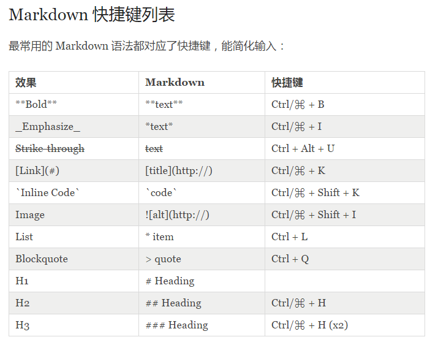

Markdown 是一种轻量级的「标记语言」，它的优点很多，目前也被越来越多的写作爱好者，撰稿者广泛使用。  

**使用 Markdown 的优点**   

* 专注你的文字内容而不是排版样式，安心写作。  
* 轻松的导出 HTML、PDF 和本身的 .md 文件。  
* 纯文本内容，兼容所有的文本编辑器与字处理软件。  
* 随时修改你的文章版本，不必像字处理软件生成若干文件版本导致混乱。  
* 可读、直观、学习成本低。  

**Markdown 语法的简要规则**   

* 标题  

 标题是每篇文章都需要也是最常用的格式，在 Markdown 中，如果一段文字被定义为标题，只要在这段文字前加 # 号即可。

# 一级标题
## 二级标题
### 三级标题
以此类推，总共六级标题，建议在井号后加一个空格，这是最标准的 Markdown 语法。

* 有序列表与无序列表  

 列表的显示只需要在文字前加上 - 或 * 即可变为无序列表，有序列表则直接在文字前加1. 2. 3. 符号要和文字之间加上一个字符的空格。

* 引用

 如果你需要引用一小段别处的句子，那么就要用引用的格式。
> `/*这是一条注释*/`

* 图片与链接

 插入链接与插入图片的语法很像，区别在一个 !号

 图片为：`{ImgCap}{/ImgCap}`

 链接为：`[]()`

* 粗体与斜体  
 Markdown 的粗体和斜体也非常简单，用两个 * 包含一段文本就是粗体的语法，用一个 * 包含一段文本就是斜体的语法。

* 表格
```markdown{numberLines: true}
| Tables  | Are     | Cool    | Remark  |
|:-------:|:-------:|:-------:|:-------:|
| col3 is | right   |  $1600  | 234     |
| col2 is | center  |   $12   | 234     |
| zebra   | are     |   $1    | 234     |
|   --    | String  |    --   | 234     | 
```
| Tables  | Are     | Cool    | Remark  |
|:-------:|:-------:|:-------:|:-------:| 
| col3 is | right   |  $1600  | 234     |
| col2 is | center  |   $12   | 234     |
| zebra   | are     |   $1    | 234     |
|   --    | String  |    --   | 234     |

* 代码框  
```{numberLines: true}
如果你是个程序猿，需要在文章里优雅的引用代码框，在 Markdown下实现也非常简单，只需要用两个`把中间的代码包裹起来。
```

* 分割线

 分割线的语法只需要三个 * 号，例如：
***
* 常用文本案例：


链接 : `[Title](URL)`     
加粗 : `**Bold**`  
斜体 : `*Italics*`  
删除线 : `<del>text</del>`  
高亮 : `==text==`   
段落 : `段落之间加一个空行`  
折行 : `在行尾添加两个空格`  
列表 : `* 列表中每一个条目都以一个星号开头。`  
引用 : `> Quote`  
行内代码 : `alert('Hello World')`;  
水平分割线 (HR) : `--------` 


